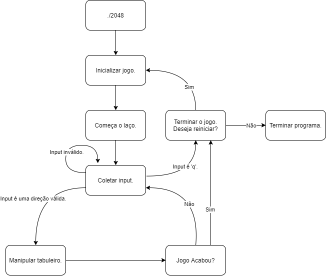

# Tabela de Conteúdos

1.  [Objetivos](#orgd9c7fad)
2.  [Premissas](#org193defe)
    1.  [Funcionamento do jogo](#org2067556)
    2.  [Especificações do usuário](#org554c980)
3.  [Regras](#orgb9b511e)
    1.  [Comandos do jogo](#orgd448981)
    2.  [Compilação](#orgd6b75f1)
4.  [Saída](#orgf5ad89e)
5.  [Ferramentas Utilizadas](#orgd8df0e8)
6.  [Mais Detalhes Sobre Algumas Funções](#orgd8df0e9)
7.  [Diagrama](#orgd8df0e0)
8.  [Vídeo de Apresentação](#orgd8df0f0)

# Objetivos

Implementar o jogo 2048 em C para o terminal com uma interface com cores (utilizando ncurses) e com um high score que persiste mesmo após o término da execução do programa.

# Premissas

## Funcionamento do jogo

O jogo terá sempre, no máximo, um tabuleiro rodando por vez. Quando o jogo é terminado, não terá nenhum tabuleiro ativo.

As informações do tabuleiro serão guardadas em uma estrutura `GAME_ENV` e as funções e métodos irão operar sobre a estrutura geral (para evitar o uso de variáveis de escopo global).

## Especificações do usuário

Como utilizamos `ncurses` para a parte visual, assumimos que o usuário utilize um sistema `unix`, seja ele uma distribuição `linux` que suporte a biblioteca ou `MacOS` (testado em ambos sistemas operacionais). Além disso, assumimos que o usuário possui um terminal que suporte, no mínimo, 256 cores, caso contrário toda a parte do ncurses que utiliza cores não irá funcionar; tal premissa é razoável dado que a maior parte dos terminais modernos possuem suporte para 256 cores. Por fim, para compilar o jogo localmente, assumimos também que o jogador possui a biblioteca `ncurses` instalada.

# Regras

## Comandos do jogo

A movimentação do tabuleiro poderá ser feita com as teclas WASD (maiúscula ou minúscula) bem como com as setas do keypad.
Para terminar o jogo atual, o usuário pode apertar a letra 'q' (maiúscula ou minúscula) em qualquer momento enquanto o jogo estiver ativo, e então será levado para a tela de "Fim de jogo".

Na tela de "Fim de jogo", o usuário pode apertar a letra 'q' (maiúscula ou minúscula) novamente para finalizar a execução do programa (e o highscore será salvo automaticamente) ou apertar a letra 'r' (maiúscula ou minúscula) para iniciar um novo jogo.
Suporte para finalizar a execução precocemente (através do input `Ctrl-C`) **não** foi adicionado. Caso o usuário deseje fechar o jogo, deve apertar 'q' duas vezes.

## Compilação

A makefile utilizada facilita o processo de compilação. Para compilar, o usuário apenas precisa rodar o comando `make build` após clonar o repositório. Para deletar os arquivos criados, deve-se usar o comando `make clean`.

# Saída

-   Ao executar o programa, será primeiramente exibido na tela o tabuleiro `4x4` inicial junto da interface de usuário à direita. Cada casa que tiver uma peça ativa será colorida com a cor da peça, e as que estão vazias serão coloridas com a cor padrão do tabuleiro.
-   Ao movimentar o tabuleiro, caso o movimento mude o estado atual das peças, as informações de `score`, `highscore` e `rounds` serão devidamente atualizadas e o novo tabuleiro será exibido na tela; caso não mude o estado atual, nada será feito.
-   Ao apertar "q", a tela ficará vermelha, sinalizando ao usuário que o jogo foi terminado. Nesse momento, também será uma saída o arquivo `high_score.txt`, que será criado para armazenar o atual highscore (caso seja maior que o antigo).
    -   Ao apertar "r" na tela de fim de jogo, o background voltará às cores normais, e a interface de usuário retornará à tela padrão com o score e rounds reiniciados, e o highscore devidamente definido, para indicar que um novo jogo foi criado.
    -   Ao apertar "q" novamente na tela de fim de jogo, o programa salva o highscore novamente e finaliza a execução
-   Ao atingir uma casa com 2048, o background ficará verde, indicando ao usuário que o jogo foi ganho; o highscore será salvo e os mesmos comandos da tela de fim de jogo("r" para reiniciar e "q" para sair) serão aceitos.

# Ferramentas Utilizadas

-   Ponteiros e alocação dinâmica de memória foram constantemente utilizados, bem como o uso de vetores uni e bidimensionais, para armazenar as diversas informações do tabuleiro.
-   Multiarquivos e compilação com arquivos header.
-   Entrada e saída de arquivos utilizando as funções `fscanf` e `fprintf` da biblioteca `stdio`.
-   Estruturas e o acesso de variáveis nelas através de ponteiros.
-   Escopo de variáveis e funções.
-   Uso amplo de funções e variáveis.

# Mais Detalhes Sobre Algumas Funções

## startGameEnvironment:
Inicializa funções do ncurses para editar o visual do jogo futuramente. Também inicializa a forma de input que será usada, definindo por exemplo que a tecla `ENTER` não será necessária pra detectar input, que o input do usuário não será printado, além de habilitar o keypad.
    
Inicia a estrutura necessária `game_environment`, do tipo `GAME_ENV`, que armazena todas as informações pertinentes ao jogo: a pontuação `actualScore` atual do jogador, a pontuação `highScore` mais alta que ele já teve, o estado `gameStatus` atual do jogo (se ele está perdido/ganho/acontecendo), a quantidade `rounds` de rodadas, as dimensões `width`x`height` do tabuleiro, o ponteiro para o array `gamePositions`, que guarda cada posição do tabuleiro, e um ponteiro para o array de janelas do ncurses `gameBoard`, que serve para editar visualmente o tabuleiro.
    
Essa função é responsável por pegar o high score do arquivo `high_score.txt`, criar as janelas do ncurses, adicionar 2 blocos aleatórios iniciais e exibir tudo na tela, tudo isso por meio de outras funções, as quais chama em ordem.

## runGameLoop:
Essa é a função mais importante do jogo: ela mantém o jogo rodando, laço por laço, pegando no início de cada laço o input do jogador e chamando sub-funções correspondentes. Por exemplo, se o input é uma direção válida (que movimenta o tabuleiro), ela chama a `executeMove` de acordo, adiciona um novo quadrado ao tabuleiro com `createRandomSquare`, exibe o novo tabuleiro com `blitToScreen` e testa para ver se o jogo foi ganho ou perdido com `testIfGameIsWon`/`testIfGameIsLost`. Se o input for 'q', quebra o loop, encerrando o jogo.

## executeMove/moveBoardtoLeft/rotateMatrix90Degrees:
Esse trio de funções é responsável por executar todos os movimentos do jogo. Começando pela mais essencial, a `moveBoardtoLeft` é uma função que itera por todos os quadrados no tabuleiro, linha por linha., jogando todos eles pra esquerda até o primeiro obstáculo (e juntando quadrados iguais, se necessário).

Mas essa função por si só não é capaz de realizar todos os movimentos. Por isso, sua auxiliar `rotateMatrix90Degrees` rotaciona a matriz 90º no sentido anti-horário. Com isso, é possível rotacionar o tabuleiro quantas vezes necessário para que um movimento para a esquerda corresponda a um movimento para qualquer outra direção.

Por fim, `executeMove` é a função mais externa do trio: baseada no input do usuário, ela vai executar `rotateMatrix90Degrees` um número 0<=n<4 vezes, de forma que o tabuleiro fique orientado corretamente para a `moveBoardtoLeft` poder fazer seu trabalho. No final, roda novamente o tabuleiro 4-n vezes para que volte para a posição original. O número de vezes que `rotateMatrix90Degrees` é chamada está explicitada pelas constantes no início do código (0/0º para esquerda, 1/90º para baixo, 2/180º para direita, 3/270º para cima).

## testIfGameIsWon/testIfGameIsLost:
Esse par de funções termina o jogo se o usuário ganhou ou perdeu o jogo. `testIfGameIsLost` testa se o tabuleiro ainda pode ser mudado, testando cada um dos 4 casos possíveis. `testIfGameIsWon` testa se há um quadrado com o valor 2048 no tabuleiro. Essas funções são chamadas todo final de rodada pela `runGameLoop`, alterando o `gameStatus` de acordo com a situação.

## manageEndGame:
Quando essa função é chamada, o jogo já acabou. A `manageEndGame` vai conferir o input do usuário (que pode ser 'q' para fechar o jogo ou 'r' para reiniciá-lo), e chamar as funções necessárias de acordo com isso.
    
Se o input for 'q', `endProgram` é chamada. Essa função vai salvar o high score, desfazer as configurações de input feitas no início do jogo, desativar o ncurses e fechar a janela do jogo.

Se o input for 'r', a função vai salvar o high score, apagar o tabuleiro atual com `free` e chamar novamente `startGameEnvironment` e `runGameLoop`.

## blitToScreen:
Essa função é a principal quando se trata do aspecto visual do jogo, pois é responsável por exibir para o usuário, em uma janela do terminal, o estado atual do jogo. Chama `drawBoard` e `drawUIScreen`, que desenham, respectivamente, o tabuleiro e o placar à direita dele, utilizando-se de todas as informações na estrutura `game_environment`. É chamada a cada laço de `runGameLoop`, após todas as manipulações causadas pelo input do usuário, para que sejam exibidas as mudanças no tabuleiro e os novos valores no placar.

# Diagrama

# Vídeo de Apresentação

https://www.youtube.com/watch?v=bu978BKESEI&feature=youtu.be
